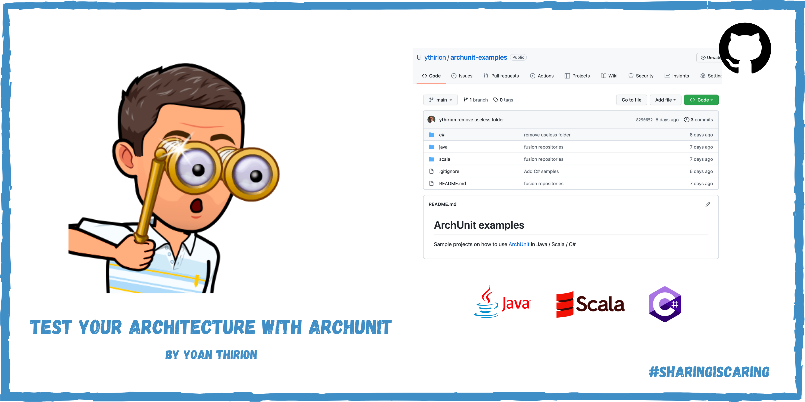

# ArchUnit examples
Sample projects on how to use [ArchUnit](https://www.archunit.org/) in Java / Scala / C#

## Slides
Slide deck explaining principles behind `Architecture Testing` available [here](https://speakerdeck.com/thirion/test-your-architecture-with-archunit).

